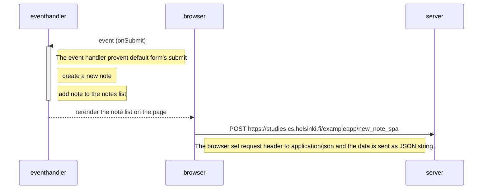

# Sequence Diagram for New Note Single Page App Example
when user create a new note by writing something into the text field and clicking `Save` button in Single Page App.

```mermaid
sequenceDiagram
    participant eventhandler
    participant browser
    participant server

    browser->>eventhandler: event (onSubmit)
    activate eventhandler
    note right of eventhandler: The event handler prevent default form's submit
    note right of eventhandler: create a new note
    note right of eventhandler: add note to the notes list
    deactivate eventhandler
    eventhandler-->>browser: rerender the note list on the page

    browser->>server: POST https://studies.cs.helsinki.fi/exampleapp/new_note_spa
    note right of browser: The browser set request header to application/json and the data is sent as JSON string.

```